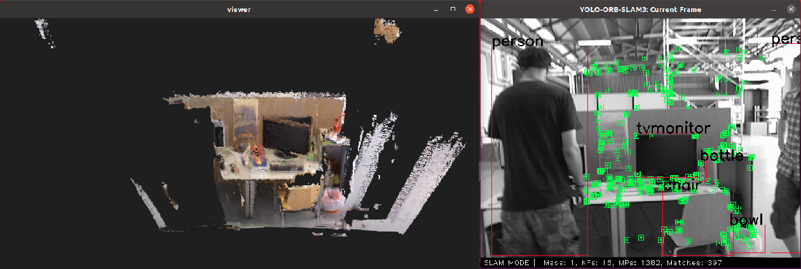
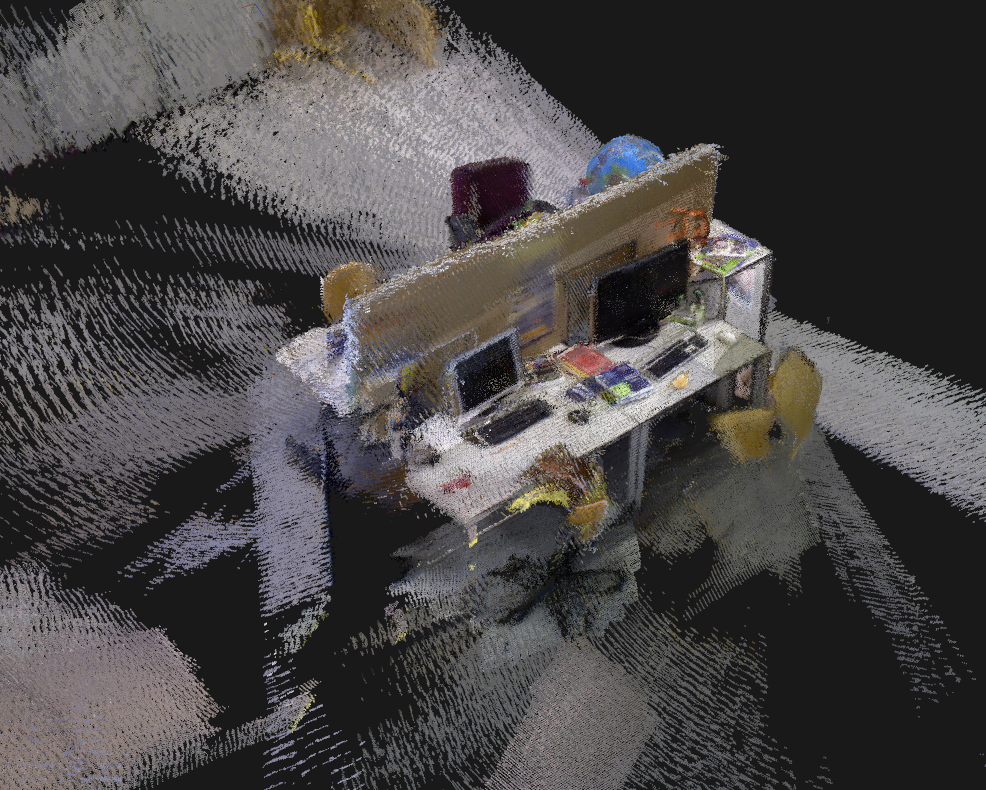
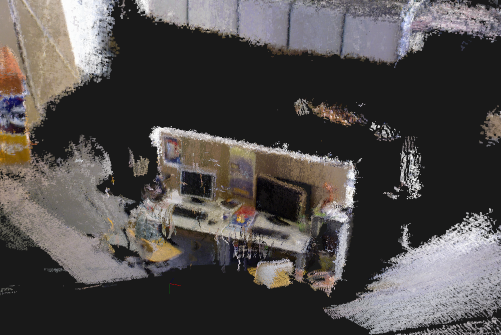

# YOLO_ORB_SLAM3_with_pointcloud_map
**This code is an extended version of [YOLO_ORB_SLAM3](https://github.com/YWL0720/YOLO_ORB_SLAM3), which adds the functionality of creating dense point cloud maps.**
- Object Detect
- Dynamic SLAM
- PointCloudMapping


<p align="center">
  
  <br>
  <em>Fig 1 : Test with TUM dataset</em>
</p>

<p align="center">
  
  
  <br>
  <em>Fig 2 : Static Scene(left) vs Dynamic Scene(right)</em>
</p>

## Getting Started
### 0. Prerequisites

We have tested on:

>
> OS = Ubuntu 20.04
>
> OpenCV = 4.2
>
> [Eigen3](http://eigen.tuxfamily.org/index.php?title=Main_Page) = 3.3.9
>
> [Pangolin](https://github.com/stevenlovegrove/Pangolin) = 0.5
>
> [ROS](http://wiki.ros.org/ROS/Installation) = Noetic


### 1. Install libtorch

#### Recommended way
You can download the compatible version of libtorch from [Baidu Netdisk](https://pan.baidu.com/s/1DQGM3rt3KTPWtpRK0lu8Fg?pwd=8y4k)
code: 8y4k,  then
```bash
unzip libtorch.zip
mv libtorch/ PATH/YOLO_ORB_SLAM3_with_pointcloud_map/Thirdparty/
```
#### Or you can

```bash
wget https://download.pytorch.org/libtorch/cpu/libtorch-cxx11-abi-shared-with-deps-1.11.0%2Bcpu.zip
unzip libtorch-cxx11-abi-shared-with-deps-1.11.0%2Bcpu.zip
mv libtorch/ PATH/YOLO_ORB_SLAM3_with_pointcloud_map/Thirdparty/
```

### 2. Build
```bash
cd YOLO_ORB_SLAM3_with_pointcloud_map
chmod +x build.sh
./build.sh
```

Only the rgbd_tum target will be build.

### 3. Build ROS Examples
Add the path including *Examples/ROS/YOLO_ORB_SLAM3_with_pointcloud_map* to the ROS_PACKAGE_PATH environment variable. Open .bashrc file:
```bash
gedit ~/.bashrc
```
and add at the end the following line. Replace PATH by the folder where you cloned YOLO_ORB_SLAM3_with_pointcloud_map:
```bash
export ROS_PACKAGE_PATH=${ROS_PACKAGE_PATH}:PATH/YOLO_ORB_SLAM3_with_pointcloud_map/Examples/ROS
```
Then build
```bash
chmod +x build_ros.sh
./build_ros.sh
```

Only the RGBD target has been improved.

The frequency of camera topic must be lower than 15 Hz.

You can run this command to change the frequency of topic which published by the camera driver.
```bash
roslaunch YOLO_ORB_SLAM3_with_pointcloud_map camera_topic_remap.launch
```

### 4. Try

#### TUM Dataset

```bash
./Examples/RGB-D/rgbd_tum Vocabulary/ORBvoc.txt Examples/RGB-D/TUMX.yaml PATH_TO_SEQUENCE_FOLDER ASSOCIATIONS_FILE
```

#### ROS

```bash
roslaunch YOLO_ORB_SLAM3_with_pointcloud_map camera_topic_remap.launch
rosrun YOLO_ORB_SLAM3_with_pointcloud_map RGBD PATH_TO_VOCABULARY PATH_TO_SETTINGS_FILE
```
